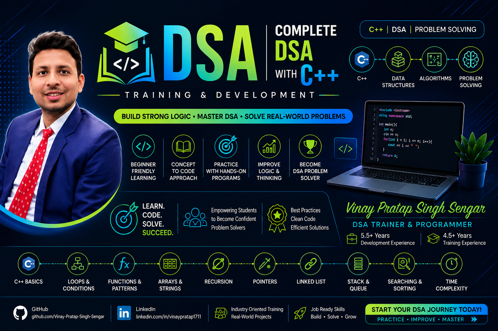

<p align="center">
  
</p>

# 🚀 DSA with C++ – Training Repository

Welcome to the **DSA with C++** repository.

I am **Vinay Pratap Singh Sengar**, a **MERN Stack Developer & Technical Trainer** with **5.5+ years of development experience** and **4.5+ years of training experience**.

This repository is created for students who are **new to Programming, C++, Data Structures, and Algorithms**.

The main goal of this repository is to help students build a strong foundation in **C++ programming, logical thinking, problem solving, and basic Data Structures & Algorithms**.

> **Learn the Basics → Practice → Build Logic → Solve Problems → Learn DSA**

---

# 👨‍🏫 About the Trainer

### **Vinay Pratap Singh Sengar**

* MERN Stack Developer – **5.5+ Years**
* Technical Trainer – **4.5+ Years**
* Trainer for **C++, Java, JavaScript, React, Node.js, Express.js, MongoDB, and DSA**
* Focused on **beginner-friendly and practical learning**
* Industry-oriented teaching approach
* GitHub: **Vinay-Pratap-Singh-Sengar**

---

# 📚 What You Will Learn

This repository follows a **step-by-step approach** for students who are starting DSA from the beginning.

Students will learn:

* C++ Programming Basics
* Programming Logic
* Functions
* Arrays
* Strings
* Basic Problem Solving
* Searching
* Sorting
* Time Complexity
* Recursion
* Pointers
* Structures
* Linked List
* Stack
* Queue
* Basic C++ STL
* DSA Practice Problems

---

# 💻 Module 1 – C++ Programming Basics

Before starting Data Structures, students need to understand the basic concepts of C++.

### Topics Covered

* Introduction to C++
* Writing the First C++ Program
* `main()` Function
* `cout`
* `cin`
* Variables
* Data Types
* Constants
* Operators

### Example Topics

```cpp
int age = 20;
float marks = 85.5;
char grade = 'A';
string name = "Vinay";
```

---

# 🔀 Module 2 – Conditional Statements

Students will learn how programs make decisions.

### Topics Covered

* `if`
* `if-else`
* `else-if`
* Nested `if`
* `switch`
* Conditional Operator

### Practice Problems

* Check Even or Odd
* Check Positive or Negative
* Find Greatest of Two Numbers
* Find Greatest of Three Numbers
* Check Leap Year
* Check Vowel or Consonant
* Simple Calculator

---

# 🔁 Module 3 – Loops

Loops are important for solving programming and DSA problems.

### Topics Covered

* `for` Loop
* `while` Loop
* `do-while` Loop
* Nested Loops
* `break`
* `continue`

### Practice Problems

* Print Numbers
* Sum of Numbers
* Multiplication Table
* Factorial
* Reverse a Number
* Count Digits
* Sum of Digits
* Check Palindrome Number
* Prime Number
* Fibonacci Series

---

# 🔢 Module 4 – Pattern Programming

Pattern problems help students develop programming logic.

### Topics Covered

* Star Patterns
* Number Patterns
* Character Patterns
* Nested Loop Problems

### Example

```text
*
**
***
****
*****
```

Students will gradually move from simple patterns to slightly more challenging patterns.

---

# 🧩 Module 5 – Functions

Students will learn how to divide a large program into smaller reusable blocks.

### Topics Covered

* What is a Function?
* Function Declaration
* Function Definition
* Function Calling
* Parameters
* Return Values
* Multiple Parameters
* Function with No Return Value
* Function with Return Value

### Practice Problems

* Add Two Numbers
* Find Maximum
* Check Prime
* Calculate Factorial
* Check Palindrome
* Find Square and Cube

---

# 📦 Module 6 – Arrays

Arrays are the first major Data Structure students will learn.

### Topics Covered

* What is an Array?
* Array Declaration
* Array Initialization
* Accessing Elements
* Array Traversal
* Taking Array Input
* Printing Array
* Updating Elements
* Finding Maximum
* Finding Minimum
* Sum of Array
* Average of Array
* Searching in Array
* Reverse an Array

### Practice Problems

* Find Largest Element
* Find Smallest Element
* Calculate Sum
* Count Even and Odd Elements
* Reverse Array
* Find Duplicate Elements
* Find Second Largest Element

---

# 🔤 Module 7 – Strings

Students will learn basic string manipulation and problem solving.

### Topics Covered

* Character
* Character Array
* `string`
* String Input
* String Traversal
* String Length
* String Comparison
* Reverse String
* Palindrome String
* Count Characters
* Vowels and Consonants

### Practice Problems

* Reverse a String
* Check Palindrome
* Count Vowels
* Count Consonants
* Count Spaces
* Find Character Frequency

---

# 🔍 Module 8 – Searching

Students will learn how to find elements efficiently.

### Topics Covered

### Linear Search

* Searching an element
* Finding position
* Finding occurrence

### Binary Search

* Introduction
* Sorted Arrays
* Binary Search Logic
* Implementation

Students will understand the difference between:

```text
Linear Search
O(n)
```

and

```text
Binary Search
O(log n)
```

---

# 🔃 Module 9 – Sorting

Students will start with simple sorting algorithms.

### Topics Covered

* Why Sorting is Required
* Ascending Order
* Descending Order
* Bubble Sort
* Selection Sort
* Insertion Sort

Students will understand:

* How the algorithm works
* Dry Run
* C++ Implementation
* Time Complexity

---

# 📊 Module 10 – Time Complexity

Students will be introduced to the basic idea of algorithm efficiency.

### Topics Covered

* What is an Algorithm?
* Why Complexity Matters
* Time Complexity
* Space Complexity
* Big-O Notation

### Basic Complexities

```text
O(1)
O(n)
O(n²)
O(log n)
```

Students will learn complexity through simple examples rather than mathematical theory.

---

# 🔄 Module 11 – Recursion

Recursion will be introduced after students are comfortable with functions and loops.

### Topics Covered

* What is Recursion?
* Base Condition
* Recursive Call
* Recursion Flow
* Stack Concept

### Basic Problems

* Print Numbers
* Print Numbers in Reverse
* Factorial
* Sum of Numbers
* Fibonacci
* Power of a Number
* Reverse a String

---

# 👉 Module 12 – Pointers

Students will be introduced to pointers before moving toward linked lists.

### Topics Covered

* What is a Pointer?
* Address Operator `&`
* Dereference Operator `*`
* Pointer Variables
* Pointer with Functions
* Pointer with Arrays
* Basic Dynamic Memory Concept

---

# 🏗️ Module 13 – Structures

Students will learn how multiple types of information can be grouped together.

### Topics Covered

* Structure Introduction
* Structure Declaration
* Structure Variables
* Accessing Members
* Array of Structures
* Structure with Functions

### Example

```cpp
struct Student {
    string name;
    int age;
    float marks;
};
```

---

# 🔗 Module 14 – Linked List

After understanding pointers, students will learn their first dynamic Data Structure.

### Topics Covered

* Introduction to Linked List
* Node
* Creating a Node
* Connecting Nodes
* Traversing Linked List
* Insertion
* Deletion
* Searching
* Display Linked List

### Basic Types

* Singly Linked List
* Introduction to Doubly Linked List

---

# 📚 Module 15 – Stack

Students will learn the concept of **LIFO – Last In, First Out**.

### Topics Covered

* Stack Introduction
* LIFO
* Push
* Pop
* Peek
* Stack using Array
* Basic Stack Problems

### Real-world Examples

* Undo Operation
* Browser Back Button
* Function Call Stack

---

# 🚶 Module 16 – Queue

Students will learn the concept of **FIFO – First In, First Out**.

### Topics Covered

* Queue Introduction
* FIFO
* Enqueue
* Dequeue
* Front
* Rear
* Queue using Array
* Basic Queue Problems

### Real-world Examples

* Ticket Counter
* Printer Queue
* Waiting Line

---

# 🧰 Module 17 – Basic C++ STL

After students understand the basic concepts manually, they will be introduced to commonly used STL containers.

### Topics Covered

* `vector`
* `stack`
* `queue`
* `pair`
* Basic `sort()`
* Basic `reverse()`

The focus will be on **understanding the data structure first and using STL afterward**.

---

# 🧠 Problem Solving

Problem solving will be included throughout the course.

Students will learn how to approach a problem step by step:

```text
Understand the Problem
        ↓
Identify Input & Output
        ↓
Think of the Logic
        ↓
Write Algorithm
        ↓
Dry Run
        ↓
Write C++ Code
        ↓
Test the Code
        ↓
Analyze Complexity
```

---

# 📝 Practice Problems

Each topic will contain practice problems from **easy to moderate level**.

### Practice Categories

* Basic Logic Problems
* Number Problems
* Pattern Problems
* Array Problems
* String Problems
* Searching Problems
* Sorting Problems
* Recursion Problems
* Linked List Problems
* Stack Problems
* Queue Problems

---

# 🧪 Assignments

Students will receive regular assignments based on the concepts taught in class.

Assignments may include:

* Programming Questions
* Logic Building Questions
* Output-based Questions
* Debugging Questions
* DSA Problems
* Practice Sets
* Revision Tests

---

# 📁 Repository Structure

```text
DSA-with-CPP/
│
├── 01_C++_Basics/
│   ├── Variables/
│   ├── DataTypes/
│   ├── Operators/
│   └── Input_Output/
│
├── 02_Conditional_Statements/
│
├── 03_Loops/
│
├── 04_Pattern_Programming/
│
├── 05_Functions/
│
├── 06_Arrays/
│
├── 07_Strings/
│
├── 08_Searching/
│
├── 09_Sorting/
│
├── 10_Time_Complexity/
│
├── 11_Recursion/
│
├── 12_Pointers/
│
├── 13_Structures/
│
├── 14_Linked_List/
│
├── 15_Stack/
│
├── 16_Queue/
│
├── 17_STL/
│
├── Assignments/
│
├── Practice_Questions/
│
├── Notes/
│
└── README.md
```

---

# 📅 Daily Learning

This repository will be updated regularly with:

* 📖 Class Notes
* 💻 C++ Programs
* 🧩 Practice Problems
* 📝 Assignments
* 🧪 Tests
* 🎯 Interview Questions
* 🔍 Problem-Solving Exercises

---

# 🎯 Learning Outcomes

After completing this beginner-level course, students will be able to:

* Understand the fundamentals of C++
* Write basic C++ programs
* Develop programming logic
* Use conditions and loops effectively
* Create and use functions
* Work with arrays and strings
* Implement basic searching algorithms
* Implement basic sorting algorithms
* Understand time complexity
* Understand recursion
* Understand pointers
* Implement basic Linked Lists
* Understand Stack and Queue
* Use basic C++ STL
* Solve beginner-level DSA problems
* Build a strong foundation for advanced DSA

---

# 🚀 How to Use This Repository

### Clone the Repository

```bash
git clone https://github.com/Vinay-Pratap-Singh-Sengar/DSA-with-CPP.git
```

### Open the Repository

```bash
cd DSA-with-CPP
```

### Start Learning

Follow the modules in order.

Do not skip the C++ fundamentals if you are new to programming.

---

# 📌 Recommended Learning Path

```text
C++ Basics
    ↓
Conditions
    ↓
Loops
    ↓
Patterns
    ↓
Functions
    ↓
Arrays
    ↓
Strings
    ↓
Searching
    ↓
Sorting
    ↓
Time Complexity
    ↓
Recursion
    ↓
Pointers
    ↓
Structures
    ↓
Linked List
    ↓
Stack
    ↓
Queue
    ↓
Basic STL
    ↓
Practice Problems
```

---

# 🤝 Student Contribution

Students are encouraged to:

* Practice every program
* Solve assignments independently
* Add their own solutions
* Improve existing solutions
* Find and fix errors
* Create additional practice questions
* Contribute through Pull Requests

---

# 📧 Contact

### **Vinay Pratap Singh Sengar**

**MERN Stack Developer & Technical Trainer**

* 💻 GitHub: [Vinay-Pratap-Singh-Sengar](https://github.com/Vinay-Pratap-Singh-Sengar)
* 💼 LinkedIn: [Vinay Pratap Singh Sengar](https://www.linkedin.com/in/vinaypratap1711/)

---

# ⭐ Support

If you find this repository useful:

* ⭐ Star the repository
* 🍴 Fork the repository
* 📢 Share it with other students
* 💻 Practice regularly
* 🧩 Contribute new problems and solutions

---

# 📢 Final Note

This repository is designed as a **beginner-friendly classroom and self-learning resource** for students who are starting their journey with **C++ and Data Structures & Algorithms**.

The course focuses on building a strong foundation rather than jumping directly into complex DSA concepts.

> **Learn → Understand → Practice → Build Logic → Solve Problems → Master DSA**

## 🚀 Start with C++. Build Your Logic. Master DSA.
